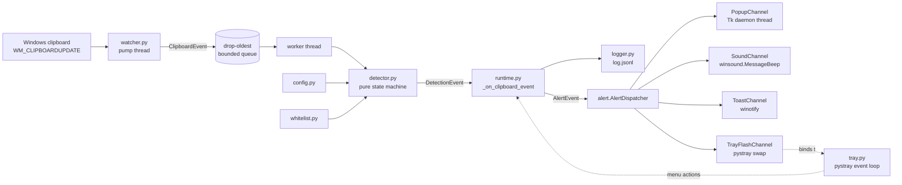

# Architecture

How the pieces fit together. Every module in `src/clipwarden/` has
one job; this doc names them and draws the graph.

## 10,000-ft view

Every arrow labelled with a type represents a clean module boundary.
The watcher knows nothing about the detector, the detector knows
nothing about Windows, the dispatcher knows nothing about which
channels exist at construction time. That layering is what lets the
runtime be fuzzed with Hypothesis and smoke-tested with a synthetic
event feed.

## Module map

| Module | Responsibility |
| --- | --- |
| `paths.py` | Resolves `%APPDATA%\ClipWarden\` and all file paths under it. Single source of truth; honours the `CLIPWARDEN_APPDATA` test override. |
| `constants.py` | Regex prefilters + tunable default windows. No behaviour. |
| `validators/` (`base58check.py`, `bech32.py`, `eip55.py`, `solana.py`, `_keccak.py`) | Pure checksum validators: Base58Check, Bech32/Bech32m, EIP-55, CryptoNote + Keccak-256, Ed25519 on-curve. |
| `classifier.py` | `classify(text)` → `ClassifiedAddress \| None`. Runs prefilters, then validators, strongest-checksum first. |
| `config.py` | Frozen `Config` + `AlertConfig` dataclasses, strict JSON validation, atomic save, corrupt-file backup policy. |
| `whitelist.py` | Exact-match address whitelist with per-chain normalisation. |
| `watcher.py` | Message-only window, `AddClipboardFormatListener`, pump thread, drop-oldest worker queue, self-write suppression hook. |
| `detector.py` | Pure state machine. Observes classified events and emits `DetectionEvent` per the substitution rule. |
| `logger.py` | Rotating JSONL audit trail (10 MB × 3). Never throws; logger errors are swallowed, not propagated to the watcher. |
| `notifier.py` | Thin `winotify` wrapper used by the toast channel and the legacy headless path. |
| `alert.py` | `AlertDispatcher`, `AlertEvent`, and the four channels: `PopupChannel`, `SoundChannel`, `ToastChannel`, `TrayFlashChannel`. `SoundChannel` is independent of the popup so the system beep still fires in headless mode or when the popup is disabled. |
| `tray.py` | `pystray` tray app: menu, state machine, pause timer, icon swap, about dialog on its own thread. |
| `autostart.py` | Idempotent `HKCU\…\Run` enable/disable for the installer hooks. |
| `singleton.py` | Named-mutex single-instance guard (`Local\ClipWarden-Singleton-Mutex`). |
| `runtime.py` | Glue: assembles watcher + detector + logger + notifier + dispatcher, exposes `start()` / `stop()`. |
| `__main__.py` | CLI entry: arg parsing, DPI awareness, singleton gate, crash log, mode selection (tray / headless / autostart hooks). |
| `build/launcher.py` | PyInstaller entry-point shim. Stdlib-only crash-log path for import-time failures. |

## Threading

Four lanes, kept deliberately separate:

1. **Pump thread** (inside `watcher.py`). Owns the message-only window
   and runs `GetMessage`. Receives `WM_CLIPBOARDUPDATE`, packages a
   `ClipboardEvent`, drops it into the bounded queue. No validation,
   no IO, no alerting - just produce events as fast as the OS
   delivers them.
2. **Worker thread** (inside `watcher.py`). Drains the queue and
   calls the owner's callback (`runtime._on_clipboard_event`). The
   queue is drop-oldest so a blocked consumer cannot stall the pump.
3. **Tray thread / main thread**. `pystray.Icon.run()` blocks on the
   main thread for the lifetime of the app. Menu callbacks run here.
4. **Short-lived daemon threads**:
   - One per popup (`PopupChannel._run`) so a Tk root cannot block
     the dispatcher or any other channel.
   - One for the About dialog (`MessageBox` on its own thread so the
     pystray loop cannot deadlock).
   - One `threading.Timer` for the tray flash revert and one for the
     pause auto-resume. Both are cancelled on quit.

`Detector` is not locked; the watcher's worker thread is the sole
caller. `AlertDispatcher` isolates per-channel exceptions, so a
broken channel cannot sink the others.

## Startup sequence

1. `main()` → `_main_inner()`.
2. `_enable_dpi_awareness()`. Must run before any window is created;
   DPI awareness is set per-process at first-window time and cannot
   be upgraded afterwards.
3. `_parse_args()` + `logging.basicConfig()`.
4. `_configure_diagnostic_logging()` if `CLIPWARDEN_DIAGNOSTIC` is
   truthy. Rotating file handler, 256 KiB × 3 backups.
5. Fast-exit paths: `--version`, `--install-autostart`,
   `--uninstall-autostart`.
6. `acquire_singleton(SINGLETON_MUTEX_NAME)`. On collision, show the
   "already running" MessageBox and exit 0.
7. Branch:
   - `--headless`: build dispatcher (toast-only, no tray), build
     runtime, `runtime.start()`, block on a stop event.
   - default (tray): build `Notifier`, `TrayFlashChannel` (unbound),
     `AlertDispatcher`, `Runtime`, `TrayApp`; bind
     `tray_app.flash` into the flash channel; `runtime.start()`;
     `tray_app.run()` blocks until Quit.
8. On any unhandled exception, `_write_crash_log()` appends a
   traceback to `%APPDATA%\ClipWarden\crash.log` and a MessageBox
   surfaces the failure before the process exits 1.

## Shutdown sequence

Bounded, per-stage, so a single wedge cannot pin exit:

1. Set the watcher's stop event.
2. Post the wake message so the pump unblocks.
3. Join the pump thread (2 s).
4. Poison-pill the worker queue.
5. Join the worker thread (2 s).
6. Flush and close the rotating log handle.
7. Cancel the pause / flash timers. `tray_app.run()` returns; the
   main thread falls through to `runtime.stop()` idempotently.

## Process identity

PyInstaller `--onefile` packages a bootloader plus the Python runtime
into a single exe. At launch the bootloader unpacks to a temp dir and
spawns a child that runs the real entry point. Task Manager shows
**two `ClipWarden.exe` processes for a single launch**. The singleton
mutex is acquired in the Python child, so the pattern is:

- First launch: bootloader + child, both named `ClipWarden.exe`.
- Second launch attempt: new bootloader + new child. The new child's
  `CreateMutex` call returns `ERROR_ALREADY_EXISTS`; the child shows
  the "already running" MessageBox and exits 0. The new bootloader
  exits immediately after.

This is documented inline at the top of `src/clipwarden/__main__.py`
so it is not mistaken for a mutex leak.

## Data at rest

All user-writable state lives under `%APPDATA%\ClipWarden\` (Roaming):

| File | Producer | Format | Retention |
| --- | --- | --- | --- |
| `config.json` | `config.save` | JSON, atomic write via `.tmp` rename | User-managed |
| `config.json.bak-<ms>` | `_backup_corrupt` | JSON (corrupt) | User-managed |
| `whitelist.json` | `whitelist` | JSON | User-managed |
| `log.jsonl` | `logger` | JSONL, one detection per line | 10 MB × 3 rotating |
| `log.jsonl.1` … `.3` | `logger` | JSONL | Rotation backups |
| `crash.log` | `__main__._write_crash_log` + `launcher.py` | Plain text, append-only | User-managed |
| `diagnostic.log` | `__main__._configure_diagnostic_logging` | Plain text, opt-in | 256 KiB × 3 rotating |

The installer writes the binary under
`%LOCALAPPDATA%\Programs\ClipWarden\` and never touches
`%APPDATA%\ClipWarden\`. Uninstall removes the binary and the Start
Menu group; user data survives.

## Extension points (v1.1+)

- A new alert channel implements the `AlertChannel` protocol
  (`fire(self, event: AlertEvent) -> None`) and is wired in via
  `build_dispatcher_for_tray()` / `build_dispatcher_for_headless()`.
  The dispatcher logs each call and isolates exceptions, so a new
  channel cannot regress existing ones.
- A new chain adds: a prefilter regex in `constants.py`, a validator
  module under `validators/`, a `Chain` enum variant in
  `classifier.py`, and an entry in the ordered dispatch inside
  `classify()`. Detector, dispatcher, and UI require no changes.
- Process-attribution lands in `watcher.py` by reading
  `GetClipboardOwner()` inside the pump thread and threading the
  window handle + PID through `ClipboardEvent`. The detector is
  pure and already accepts arbitrary metadata on the event, so the
  change is additive.

## See also

- [`detection-model.md`](detection-model.md) - the exact rule, chain
  by chain, with rationale for every non-reset.
- [`threat-model.md`](threat-model.md) - what this architecture does
  and does not defend against.
- [`../build/README.md`](../build/README.md) - how the architecture
  is frozen into a shippable exe and installer.
